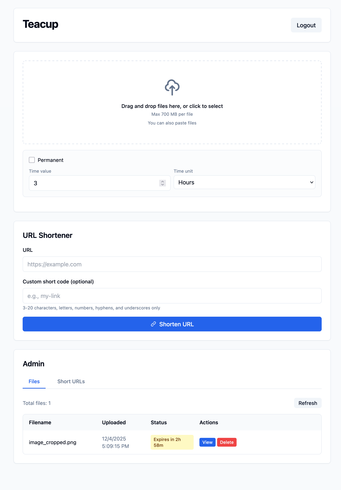

# Usage

Fill out the .env.example and remove the .example

Dockerfile and compose are included 

If you are hosting this behind cloudflare, keep in mind they have a 100MB cap for proxied files.
## Upload with curl

Use HTTP Basic Auth with the configured credentials and the `file` field:

```sh
curl -u username:password -F 'file=@./path/to/file' https://your-host/upload
```

The JSON response includes the downloadable URL. Multiple files are supported with repeated `-F file=@...` arguments.
